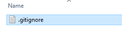
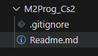

## stap 1 nieuw project


Maak in je github een nieuwe repository aan:
- naam is `M2Prog_Cs2`

- `clone` de repository naar je `computer`
- maak in `M2Prog_Cs2` een nieuwe file aan met de naam:
    - `.gitignore`
    > 

- controlleer of je directory er nu zo uitziet:
    > 

## ignore vullen

- zet in `.gitignore` het volgende:
```
**bin
**obj
**.vs
**packages
**/csproj.user
```

- commit de nieuwe file

## Simulize

- Lever je gitlink METEEN in via de opdracht
    > 

## commit

`commit` & `push` naar je git!
