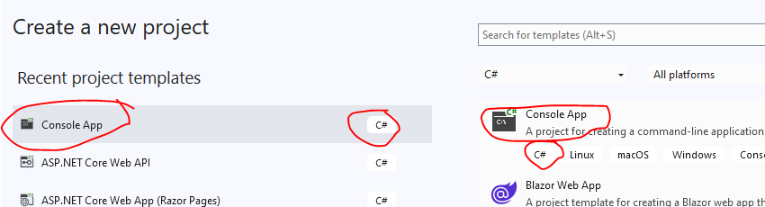
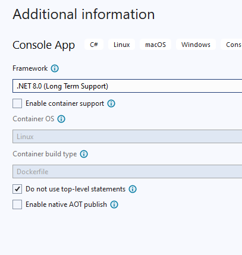

## project maken

- open visual studio community

- maak een nieuwe Console project
>
- noem het project `Functions`

- controlleer je settings:
    >
    - zet het in je `M2Prog_Cs2` directory

## commit

`commit` & `push` naar je git!