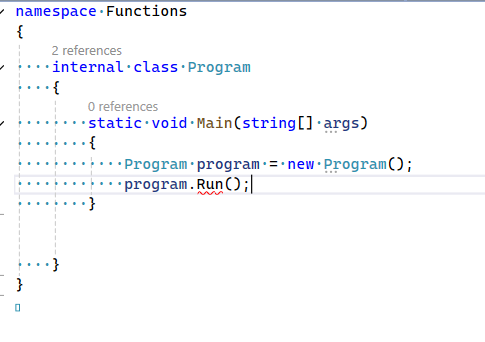
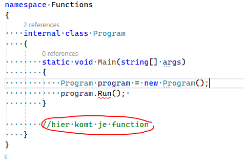
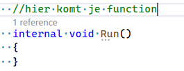

## uit de static

- open Program.cs
- we gaan nu uit de static void main function ontsnappen
    > dit is een best practice om jullie aan te leren niet met static te werken
    - maak de volgende code na:
    > 


## Run function maken

- stap 1 lees nog een keer de code 
    > 
    - bedenk je:
        - welke variable hebben we gemaakt?
            - schrijf dat in commentaar achter de regel waar dat gebeurt
            ```C#
            //dit is commentaar
            ```
        - welke type is die variable
            - schrijf dat in commentaar achter de regel waar dat gebeurt

## functions lezen:

- stap 1 lees nog een keer de code 
    > 
    - bedenk je:
        - wat is EN hoe heet de function die we gebruiken
            - schrijf dat in commentaar achter de regel waar dat gebeurt
        - wat is het return type van de function?
            - schrijf dat in commentaar achter de regel waar dat gebeurt

## function maken

- maak nu de function in Program.cs

    - dat moet op deze plek:
    > 

## controlleren en Run

- als alles goed is kan je nu je programma runnen
    - lukt dat niet check de code hieronder:
    <details> 
    <summary>Hint </summary>
    
    </details>
    
- zet nu nog een `WriteLine` in je Run function met de tekst:
    - "Dit is nu de start van mijn programma"
    >(net als hello world)

## commit

`commit` & `push` naar je git!
