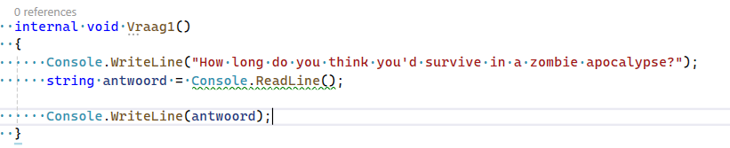
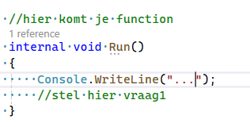
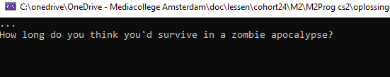
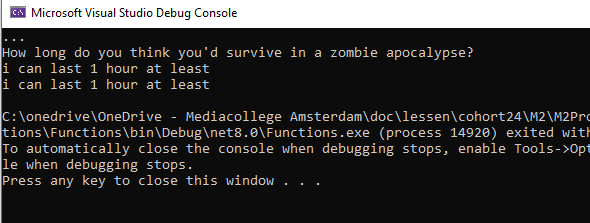

## vragen stellen

- we gaan nu wat vragen stellen aan onze gebruiker en het antwoord laten zien
    - we beginnen eenvoudig, maak dit na in Program.cs:
    >    
    - probeer zelf even de function te gebruiken in de Run function onder de writeline
    > 

    <details> 
    <summary>Hint </summary>
    
    </details>

## proberen

- run je programma en kijk of je dit krijgt:
    > 
    - geef nu antwoord en druk op enter
    > 

## Meer vragen

- maak nu nog minimaal 5 vraag functions erbij
    - kies uit de vragen hieronder, of zoek zelf LEUKE (nette) vragen
```
- How long do you think you'd survive in a zombie apocalypse?
- What secret conspiracy would you like to actually start letting other people know?
- If you can still remember, what are your funniest childhood memories?
- What would you do if you won a million dollars?
- What is the worst game you played but that you liked anyway?
- Why do round pizzas come in square boxes?
- Has someone caught you dancing in front of the mirror?
- Have you ever tried talking to a animal?
- What would you call a male ladybug?
- Which species would be the rudest if all animals could talk?
```


## commit

`commit` & `push` naar je git!
