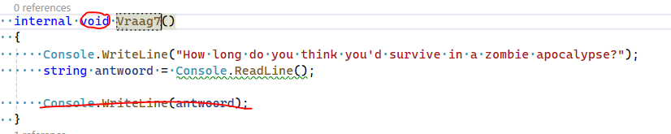
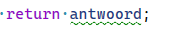
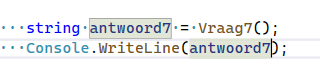
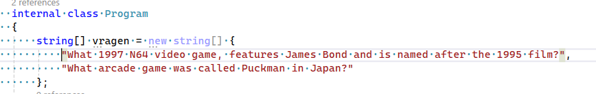
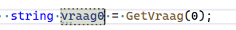
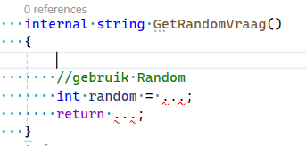
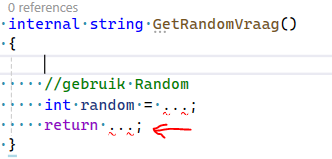
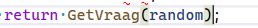

## Return

- nu gaan we een vraag anders maken
    - maak een vraag7 function
        - verander `void` in `string`
        - haal de regel hieronder weg
        >

        - voeg nu het volgende toe:
        >

## gebruiken

- probeer eerst zelf de function te gebruiken en het antwoord op het scherm te zetten
    
 
    
Lukt het niet? 

    
    

        
## Lijstje maken

- nu gaan we Program.cs een lijst met vragen geven, maak na:
    >

- we maken nu een nieuwe function die 1 vraag teruggeeft:
    >

    - probeer de function uit in Run
    >

- stop nog meer vragen uit `gamequestions.txt` in de lijst

## Random

- we maken weer een function met een return:
    >
    - vul de function zelf in zodat deze 1 vraag uit de vragen array pakt
        - gebruik de Random class uit c# om een random index te pakken
            > https://learn.microsoft.com/en-us/dotnet/api/system.random?view=net-8.0    
            >
            > Hint: uit array pakken `arrayVariableNaam[welkeIndex]`
    
- gebruik de nieuwe function ook in Run

## function gebruikt function

- Maar we hadden al een getvraag function toch?
    - om te laten zien dat we een function in een function kunnen gebruiken passen we de laatste regel aan
        >Dus deze regel:  
        > 
    - maak daar het volgende van:
        > 
        
    

## commit

`commit` & `push` naar je git!