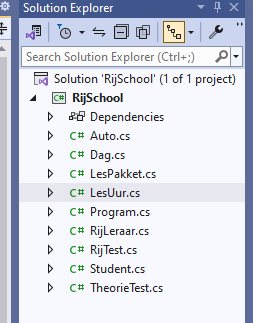

## Data classes

- lees het onderstaande:
```

om classes wat beter te leren kennen gaan we beginnen met classes te gebruiken om data te bewaren. dit noemen we even een data class.

deze doen niets behalve dingen (eigenschappen) onthouden
```

- stel we denken na over het plannen van rijlessen:
    - we hebben een auto van de school
    - we hebben rijleraren
    - we hebben studenten
    - we hebben een pakket met lessen
    - we hebben een theorie test en een rijtest
    - we hebben een dag planning


## Nieuw project

- maak een nieuw console project aan
    - RijSchool

## classes maken

- maak nu de volgende classes aan:
    - Auto
    - RijLeraar
    - Student
    - LesPakket
    - RijTest
    - TheorieTest
    - Dag
    - LesUur

- als het goed is heb je nu dit in je video studio
> 
## commit

`commit` & `push` naar je git! 