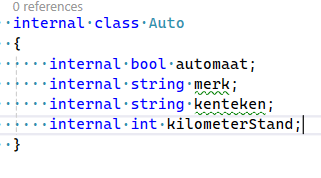
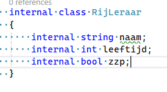
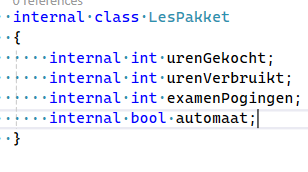
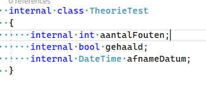
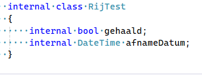
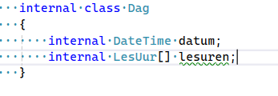
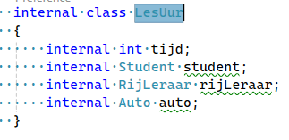
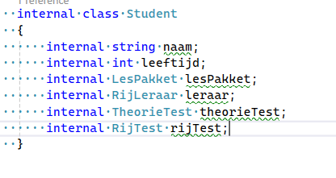

## Fields maken

- lees het volgende:
```
als je in een class een variable maakt (boven in) dan noemen we dat een `field`


Dit worden dan de eigenschappen van die class.

bijvoorbeeld een GameObject heeft x, y z coordinaten met als type float. Dan heeft elk gameobject dus die 3 coordinaten
```

## Rijschool

- open de class Auto
    - maak de volgende fields aan:
        >

- open de class RijLeraar
    - maak de volgende fields aan:
        >

## lessen

- open de class LesPakket
    - maak de volgende fields aan:
        >

- open de class TheorieTest
    - maak de volgende fields aan:
        >

        
- open de class RijTest
    - maak de volgende fields aan:
        >


## planning

- open de class Dag
    - maak de volgende fields aan:
        >

- open de class LesUur
    - maak de volgende fields aan:
        >
    

## student

- open de class Student
    - maak de volgende fields aan:
        >
    
        
## commit

`commit` & `push` naar je git! 