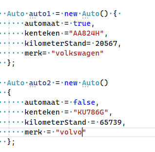
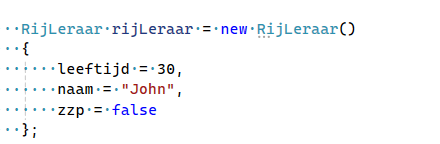
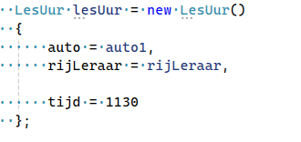
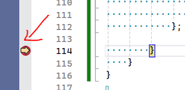
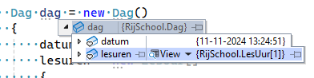
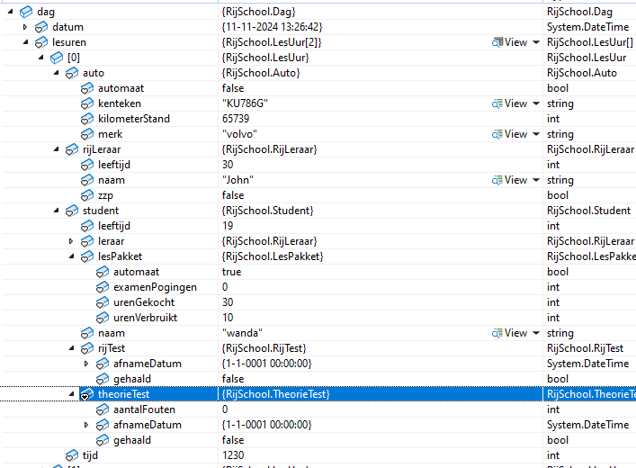

## Run

- laten we een auto maken
    - ontsnap eerst uit de static, zie `01 functions/02 no static.md` hoe je de Run function maakt;

- maak nu in de Run dit aan:
    > 

- zie je hoe je de fields kan vullen binnen de `{}` achter de `Auto()`?

- laten we het nu een rijleraar maken
    >
- en maak nu een lesUur
    >
    - zie je hoe we de auto1 koppelen aan auto van lesUur?
        - en voor de rijleraar doen we hetzelfde

## Student

- maak nu een student aan
    - vul alle data, let even op met:
        - LesPakket
        - theorietest
        - rijtest
    - koppel die ook aan lesUur

## Dag

- maak nog een student
- en maak nog een lesuur
- maak een dag
    - vul nu de lesuren array, 

## Controlleren

- zet nu een breakpoint in je code
> 
- run het programma
    - nu pauzeert het programma
- kijk of je de dag kan openklappen, en klap alles open
    > 
    - klap de hele boom open
    > 
    
## commit

`commit` & `push` naar je git! 