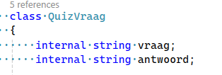
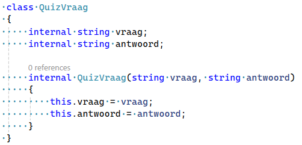
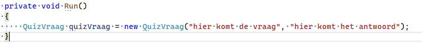
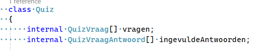
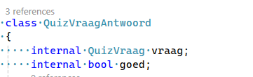

## Constructors

- maak een nieuw project met de naam:
    - Constructors

- maak weer een Run function zoals in de andere projecten

## classes maken

- maak 3 nieuwe classes aan:
    - QuizVraagAntwoord
    - Quiz
    - QuizVraag


## fields

- Open quizvraag.cs maak de fields aan:
    > 

- tijd voor de constructor!
    - maak dit na:
    > 

- lees dit:
```
Zie je dat de de constructor (internal QuizVraag) een beetje lijkt op een function?

en zie je dat we de vraag tussen de haakjes van de constructor in de body {} gebruiken?

let even goed op het patroon `this.vraag = vraag`. omdat we 2 variabelen hebben:
- 1 van de class (de field vraag)
- 1 van de constructor (vraag tussen de `()`)

```

## Vraag aanmaken

- hoe gebruiken we de constructor?
    - ga naar de Run function
        - zet dit daarin
            > 

## andere classes
- Open quizvraag.cs maak de fields aan:
    > 

- Open quizvraag.cs maak de fields aan:
    > 

## commit

`commit` & `push` naar je git! 