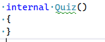
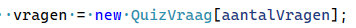
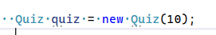
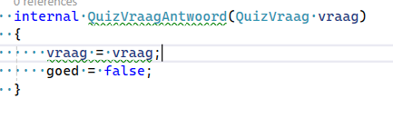

## Constructors

- tijd voor de constructor!
    - geef de andere twee classes constructors:
        - Quiz:
        > 
        - doe dat ook voor de andere class QuizVraagAntwoord

- lees:

```
nu hebben we 2 constructors, alleen deze hebben nog geen argumenten
    - de haakjes zijn dus nog leeg ()
```

## argumenten toevoegen

- ga naar de Quiz constructor
    - deze geven we 1 argument:
        - int aantalVragen
        - zet nu in de constructor:
            > 
- lees dit:
```
zie je dat we nu met het argument aantalVragen de vragen array aanmaken?

en dus niet meteen de vragen zelf vullen?
```

- doe nu hetzelfde voor ingevuldeAntwoorden

## constructor gebruiken

- ga naar Run
    - maak nu een quiz met 10 vragen:
        > 

## QuizVraagAntwoord

- maak dit na in QuizVraagAntwoord:
    > 
    - zie je die groene kriebel lijn?
        - wat is daar mis mee?
            - verbeter het! kijk ook naar QuizVraag


## commit

`commit` & `push` naar je git! 