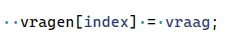
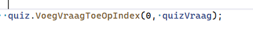

## vragen toevoegen

- ga naar Quiz.cs
    - we maken nu een function erbij:
        - void
        - VoegVraagToeOpIndex
        - argumenten:
            - int index
            - QuizVraag vraag

    - in de body (`{}`) zetten we 
    code die de vraag in vragen zet op index:
    >

## run

- ga naar Run
    - voeg nu een vraag toe aan de quiz:
        >
        
## overload

- maak nog een function:
    - void
    - VoegVraagToeOpIndex
    - argumenten:
        - int index
        - string vraag
        - string antwoord

## body

- maak in de body `{}` de volgende code:
    - maak een nieuwe QuizVraag, 
        - gebruik vraag en antwoord in de constructor
    - zet die nieuwe vraag op `vraag[index]`, LET OP:
        - gebruik de andere `VoegVraagToeOpIndex` function

## toevoegen

- zorg in run dat je alle vragen vult (0 tot 10)
    - gebruik `BIJDE` VoegVraagToeOpIndex functions 

## commit

`commit` & `push` naar je git! 