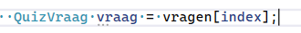
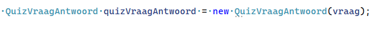

## QUIZ

nu hebben we een quiz gemaakt

- voeg een nieuwe function aan Quiz toe:
    - void
    - StelVraag
    - 1 argument: int vraagIndex

- in de body `{}`:
    - zet je code om de vraag op te halen:
    > 

    - maak een nieuwe QuizVraagAntwoord
        - koppel daar meteen de QuizVraag (vraag) aan:
            > 

        
    - stel nu de vraag met Console.WriteLine
    - en lees het antwoord met Console.ReadLine
        - zet in de QuizVraagAntwoord variable meteen of het antwoord goed is 
            > HINT: gebruik een if
        - laat ook meteen zien of het goed of fout was
    - bewaar nu de QuizVraagAntwoord variable in ingevuldeAntwoorden op de JUISTE plek
    
## QUIZ aflopen:

- Ga naar Run
    - loop alle vragen door met een loop
        - voor elke vraag gebruik je de StelVraag function

## Score

- maak een nieuwe function in Quiz die:
    - de score uitrekent 
    - de uitgerekende score returned

- gebruik die function in Run
    - en laat de score zien met een Console.WriteLine 
        > in RUN niet in de nieuwe function
## commit

`commit` & `push` naar je git! 