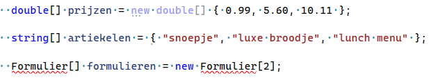
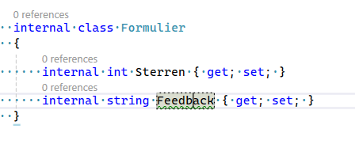
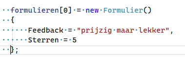
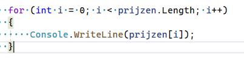
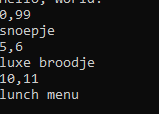
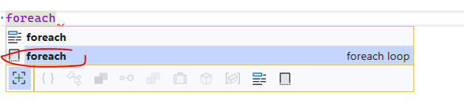
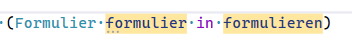
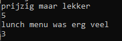

## Project maken

- maak een nieuw Console project:
    - ForHerhaling
- zorg dat je weer een Run function hebt

## Arrays maken

- we maken even 3 verschillende arrays:
> 

- lees:
```
kijk naar de code, we zien 3 manieren om arrays te maken:
- prijzen wordt op de oude manier gemaakt, en krijgt meteen waardes
- artiekelen wordt op de korte nieuwe manier gemaakt, en krijgt meteen waardes
- formulieren krijgt een vaste grote maar niet meteen waardes

we zien ook 3 verschillende types:
- double een getal
- string voor woorden

- Formulieren wat een nog niet bestaand type is, dit wordt straks een klas
```


## Formulier

- maak even een nieuwe class, dit wordt een data class:
    > 


## Formulieren array vullen

- maak de volgende code na:
    > 
- vul nu zelf het tweede formulier


## Loops

- we gaan nu de prijzen op het scherm zetten:
    > 
- zet nu ook in deze body `{}` van de for:
    - het artiekel op het scherm

## Test
- test:
    - dit zou je moeten zien:
    > 

## Artiekel erbij

- zet 1 extra prijs erbij
    - laat het artiekel nog zitten

- test!
    - je krijgt een crash?
        - waardoor komt dit?
- voeg nu ook het artiekel toe
- test!
    - nu krijg je 4 dingen op het scherm

## Formulieren en een foreach

- type nu foreach
    - kies de tweede optie en druk op tab
    > 
    - verander wat je krijgt naar:
    > 

- zet nu de reviews op het scherm:
    > 

    
## commit

`commit` & `push` naar je git! 