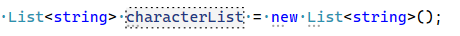
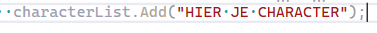
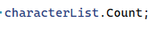
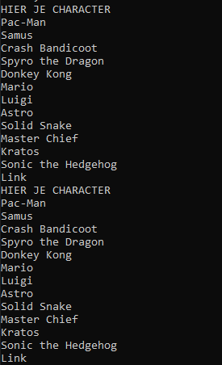

## Arrays en Lists

- lees het volgende:
```

in programma's houden we eindeloos veel lijsten bij

we hebben daar vaak 2 keuzes voor in C#:
- Arrays
- Lists

Arrays hebben een vaste grote
Lists niet.

Dus als je een lijst bijhoudt waar vaak dingen bijkomen of uitgaan pak dan een List
```


## Project maken

- maak een nieuw Console project:
    - Lists
- zorg dat je weer een Run function hebt


## Array maken

- maak nu een array variable:
    - noem deze characters
    - zet er de volgende strings in:
        ```
        Pac-Man
        Samus
        Crash Bandicoot
        Spyro the Dragon
        Donkey Kong
        Mario
        Luigi
        Astro
        Solid Snake
        Master Chief
        Kratos
        Sonic the Hedgehog
        Link
        ```

## List maken

- nu gaan we een List maken
    - maak een nieuwe variable:
        > 
    - kies zelf een character die niet in de array zit, en voeg die toe:
        > 

## voeg toe met een loop

- maak nu een for loop die over de array loopt
    > je mag ook een foreach gebruiken
- in de body `{}` van de for/foreach maken we het volgende:
    - je gebruikt `Add` om het character uit de characters array toe te voegen aan characterList 

## Laten zien

- laat nu alle characters uit de characterList zien op het scherm
    - gebruik een for
        > HINT gebruik niet Length maar 
        >   
        > 
- doe het nog een keer maar dan met de foreach

## Test

- test je programma:
    > 

## commit

`commit` & `push` naar je git! 