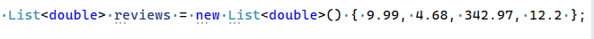
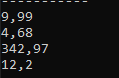
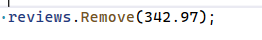
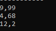

## Remove

## List maken

- nu gaan we een nieuwe List maken
    > 
    - zie je dat we nu geen string maar double hebben staan?
    - zie je dat we nu de waardes er meteen instoppen?

## Show

- zet alle getallen op het scherm
    > 

## Remove

- laten we het hoogste getal (342.97) eruit halen
    - dat doen we met remove:
        > 
    
## test!

> 
    

## nog 1 eruit

- nu gaan we nog een keer iets eruit halen, maar dan met de function RemoveAt
    > https://learn.microsoft.com/en-us/dotnet/api/system.collections.generic.list-1.removeat?view=net-8.0

    - doe dit zelf en haal de eerste eruit:
    
## test!

> 
    

## commit

`commit` & `push` naar je git! 