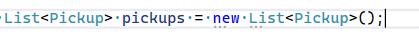
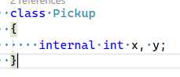
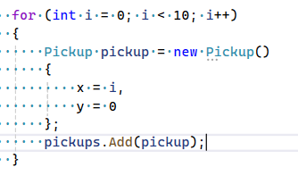
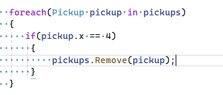
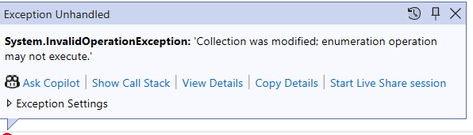
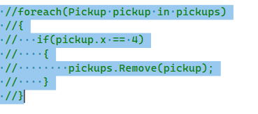
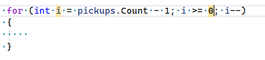
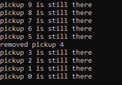

## Remove

## List maken

- nu gaan we een nieuwe List maken
    > 
    - we zien nu dat we een class tussen de `<>` hebben gezet.
        - classes zijn ook types, net als `int`, `double`, `string` etc.

## Pickup maken

- de class mist nog, maak die aan:
    > 

- stop nu meerdere pickups in de lijst,
    - gebruik een for loop:
    > 

## Oppakken

- maak de volgende code na:
    > 

- TEST!
    - hij crashed nu
        > 
    
    - lees de fout goed
        > Het is belangrijk om fouten te leren lezen
        - wat denk je dat er mis is?

## oplossen

- lees:
```
Vaak is het niet handig om dingen uit een lijst OF array te halen
terwijl je van 0 -> Eind er doorheen loopt

daar zijn meerdere oplossingen voor
- eentje die goed werkt is een for loop die van Eind -> 0 loopt
```

- laten we dat maken:
    - zet de foute code in `//` commentaar
        > 
    - maak nu deze for loop:
        > 

## Remove again

- zet daar weer de if in
    - Maar je hebt geen pickup
        - gebruik `pickups[i]`
        - gebruik RemoveAt(i) OF Remove

- zet op het scherm als de pickup opgepakt is of niet
    > 

- test!

## commit

`commit` & `push` naar je git! 