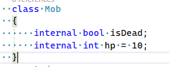
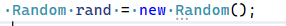
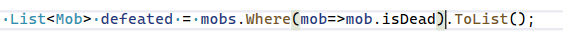

## Linq

- maak deze class:
    > 

## DoDamage

- maak een TakeDamage function op Mob:
    - void
    - int damage
    - haal damage van hp af
    - ALS hp kleiner gelijk aan 0 is DAN:
        - zet je isDead op true
## List maken

- nu gaan we een nieuwe List maken van mobs
    - stop er 3 mobs in


## Random damage

- maak een nieuwe random aan:
    > 

- maak een for loop van 0-100
    - in de body `{}`:
        - maak je een foreach loop over de mobs heen
            - in DIE body `{}`:
                - pak een Next random getal met de random
                - ALS die < 30 DAN:
                    - doe je 1 schade aan de mob met de TakeDamage function

## Wie zijn verslagen?

- Nu gaan we kijken we verslagen zijn

    - maak onder de loop dit na:
        > 
    - zet ze op het scherm

- lees:
```
zie je die Where(mob=>...)

dat is een onderdeel van Linq, daarmee kan je makkelijk lijsten bevragen en dingen uit die lijst halen
```

## commit

`commit` & `push` naar je git! 