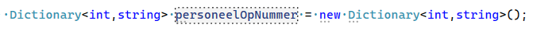
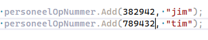
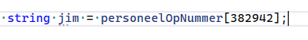
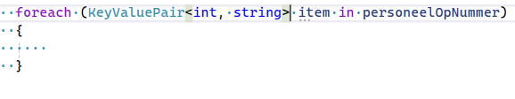
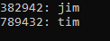
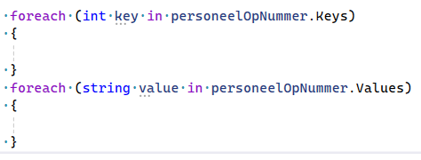

## Project maken

- maak een nieuw Console project:
    - Dictionaries
- zorg dat je weer een Run function hebt

## Dictionary maken


- lees:
```
In een dictionary kan je dingen stoppen, dus classes, strings alles wat een type is.

waarom zou je een dictionary gebruiken, terwijl er ook arrays en lists zijn?

omdat je soms iets op 1 eigenmerk wil opzoeken. Een dictionary maakt dat mogelijk op een snelle manier.

met een array moet je de hele array doorzoeken. een dictionary is beter voor dit soort dingen
```

- laten we een dictionary maken, maak deze code na:
    > 

    - nu hebben een dictionary waar we een nummer met bijvoorbeeld een naam kunnen koppelen
        - stop er wat data in:
            > 
         
## Ophalen

- om iets uit een dictionary te halen doen we dit:
    - maak dit na
        > 
- haal nu ook tim op
    - laat beide namen op het scherm zien


## Loop

- een dictionary kan ook in een loop gebruikt worden:
    > 
    - maak dat na
        - haal nu de string op door item.Value te coderen
            - zet die op het scherm

        - haal nu ook de int op door item.Key te coderen

- zorg nu dat je beide in 1 regel op het scherm zet zodat je dit krijgt:
    > 
    
## Alleen keys of Values

- je kan aan een dictionary ook .Values of .Keys vragen:
    > 
    - maak dat na
        - zet weer de keys en values op het scherm 

## commit

`commit` & `push` naar je git! 