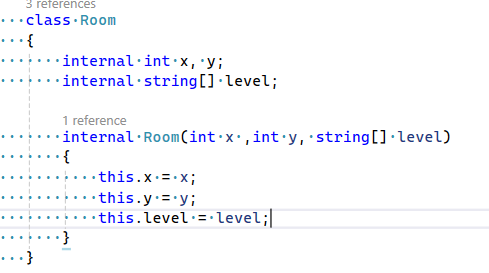
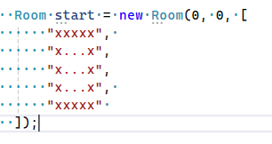
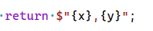
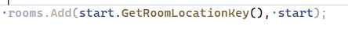
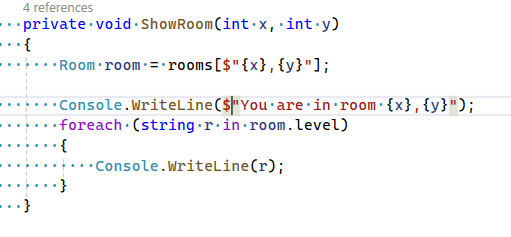
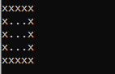
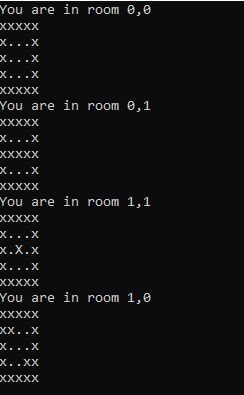
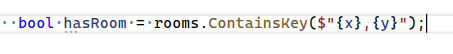
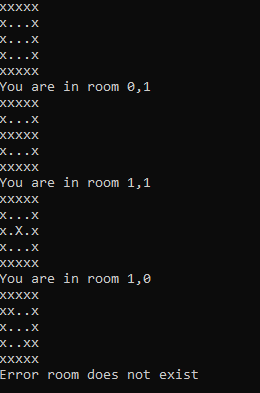

## Class maken

- we maken nu een class deze komt als Value in de dictionary

- om iets uit een dictionary te halen doen we dit:
    - maak dit na
        > 

- we maken even 1 kamer:
    > 


## KEY

- wat wordt nu onze key?
    - we maken een nieuwe function op Room erbij:
        - internal
        - string (dus geen void)
        - GetRoomLocationKey
        - geen argumenten

    - zet daar de volgende code in de body `{}`:
        > 

## dictionary

- maak nu een dictionary van `<string,Room>`
    - noem die:
        - rooms
        - Zet deze op class niveau 
            - dus onder:
            ```C#
             class Program 
             {
                //hier dus
             ```
             
    - voeg onze start kamer toe
        > 

## Kamer op key laten zien

- lees:
    ```
    we willen nu een kamer ophalen uit de directionary 
    en dan op het beeldscherm zetten

    daar maken we een nieuwe function voor
    ```

- maak een nieuwe function:
    - private
    - void
    - ShowRoom
    - argumenten:
        - int x
        - int y
    - zet de volgende code in de body:
        > 

- gebruik de function om de start kamer (0,0) te laten zien:
    > 

## Meer kamers

- maak nog 3 kamers en stop die in de dictionary
    - laat die allemaal zien
        > 

## Grijp mis

- roep nog een keer ShowRoom aan maar:
    - dan met een x en y die NIET bestaan
- Run!
    - nu crashen we,lees:
        ```
        we hebben niet gekeken of de kamer wel bestaat in de dictionary
        ```

## exists?

- ga naar ShowRoom
    - voeg de volgende code toe:
        > 
    - maak een if die ervoor zorgt dat je:
        - alleen de kamer ophaalt & tekent als de kamer bestaat
    - een else
        - die waarschuwt dat de kamer niet bestaat
- RUN
    - nu krijg je dit:
        > 
    
## commit

`commit` & `push` naar je git! 