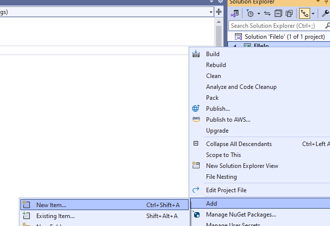
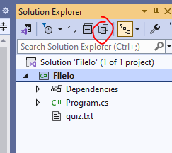
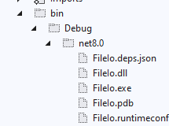
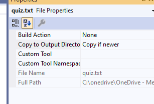
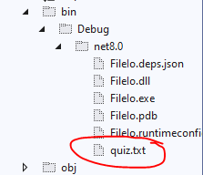

## Project maken

- maak een nieuw Console project:
    - FileIo
- zorg dat je weer een Run function hebt

## File klaar zetten

- gebruik nu:
    - rechter muis op het project -> add
        > 
    - voeg een txt file toe
        - noem deze even quiz.txt

## File vullen

- kopieeer even de tekst van gamequestions.txt naar de quiz.txt
    - build & run het project
    - click op de `show all files` knop
        > 
    - check of je nieuwe files ziet:
        > 
- open de bin
    > 
    - zie je daar de quiz.txt staan?
        
## quiz.txt & copy

- rechter muis op quiz.txt
    - properties
        - zet Copy to output ... naar Copy if newer:
            > 

- build & run nogmaals
    - nu zie je quiz wel
        > 
    
## commit

`commit` & `push` naar je git! 