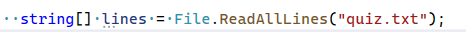

## Lezen

- nu hebben we een file, die naast de .exe staat
    >   
    > de .exe is ons programma wat runt als we run doen

- lees:
    ```
        files die naast onze .exe staan kunnen we meteen lezen,
    ```
    - maak deze code na, run de code en kijk waarom:
        >   
        - kijk goed naar de directory!

## Code!

- we gaan nu regels inlezen
    - zet deze code in je Run:
        >   
    - zet nu alle regels met een for op het scherm

## Eigen file

- voeg nu zelf nog een tekst file toe
    - kies een text van een nieuws artiekelen van https://nos.nl en zet die daarin
        - lees die file en zet dat op het scherm


## commit

`commit` & `push` naar je git! 