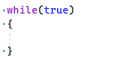
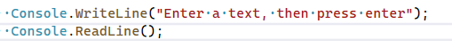
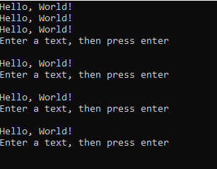
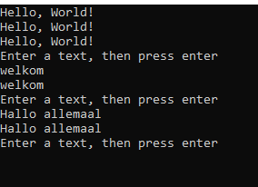
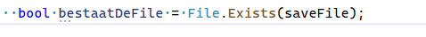
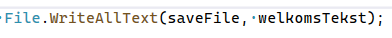
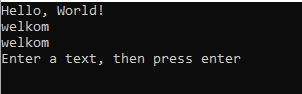

# 1 opstarten

## Project maken

- maak een nieuw Console project:
    - MemSave
- zorg dat je weer een Run function hebt

## voorbereiden

- maak een variable in de Program.cs:
    - string 
    - welkomstTekst
    - met waarde "hello world"
- zet die in Run op het scherm

## Veranderen

- zet in de Run een while loop:

    >   
    - Zet daar nogmaals een writeline in voor de welkomstTekst
    
    
    - zet daaronder:
        >   
## TEST!

- kijk of je dit krijgt als je een paar keer op enter drukt:

    >   

## Welkom veranderen

- ReadLine geeft een string waarde terug.
    - zet die waarde op welkomstTekst
        - test en kijk of dit gebeurt (je teksts komt 2x op het scherm)
            >   

# 2 Lezen en schrijven

## Bewaren van laatste staat

- lees deze uitleg:
```
we gaan nu de welkomstTekst in een file bewaren
1) als het programma start dan lezen we de file ALS deze bestaat
2) als we de tekst veranderen dan slaan we de welkomstTekst op in een file
```

- maak een nieuwe variable in de class Program:
    - string
    - saveFile
    - waarde: "welkomState.txt"

- in de Run kijken we of de file bestaat:
    >   
    - maak nu een if die kijkt of bestaatDeFile true is
        > HINT ==

- nu lezen we de file in met File.Read...., MAAR:
    - we gebruiken niet ReadAllLines maar ReadAllText

## Opslaan

- ga naar het stuk code waar we de welkomstTekst veranderen NA de Console.ReadLine
    - Nu gaan we schrijven naar de saveFile:
        >   

## TEST

- test nu:
    1) start het programma
    2) verander de tekst
    3) sluit het programma
    4) start het programma
    5) zie je je tekst weer??
    
        >   

## commit

`commit` & `push` naar je git! 