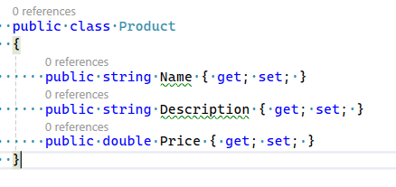
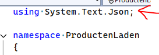
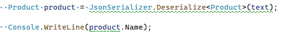
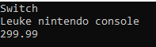
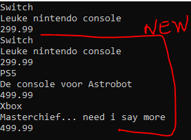

# 1 opstarten

## Project maken

- maak een nieuw Console project:
    - ProductenLaden
- zorg dat je weer een Run function hebt

## voorbereiden

- maak deze class aan:
    >   
    - kijk even goed naar de class:
        ```
        - zie je dat alles public is?
        dat is nodig om json te laten werken
        ```
- zet de `Product.json` (staat naast deze file):
    - in je project
    - zorg dat die naast de .exe komt als je build & run doet

    
## Lezen

- maak de volgende code in Run
    - lees nu de `Product.json` met File.ReadAllText in een variable:
        - string
        - text

- zet nu boven in class:
    >   

- maak deze code na in Run, onder je string text
    >   
- zet ook Description & Price op het scherm

## Test
- Build & run en kijk of je dit krijgt:
    >   


## Producten

- lees:
    ```

    je kan ook lijsten van dingen in json zetten
    bijvoorbeeld een Array van producten.
    laten we die eens uit json lezen

    ```
- zet de `Producten.json` (staat naast deze file):
    - in je project
    - zorg dat die naast de .exe komt als je build & run doet

- maak een RunProducten function (net als Run)
    - roep die aan
        - gebruik de code uit Run als basis
            - Maar verander `Product` naar `Product[]`
                >       
            - laat nu alle producten zien
                - gebruik een for of foreach
                    >       


## Zelf maken

- maak nu zelf een class
    - met minimaal 3 eigenschappen

    - ter inspiratie (als je deze kiest alle eigenschappen ^^):
    ```

        - Player
            - met x,y,z,
            - naam,
            - lvl,
            - max hp
            - hp
        - Afspraak
            - dag
            - maand
            - jaar
            - tijd
            - beschrijving
        - Vertaling
            - Beschrijving
            - Taal
            - Tekst
        - MagicKaart
            - Defense
            - Attack
            - Naam
            - Beschrijving
    ```

## Json maken

- maak nu een .json file voor die class
    - MET meerdere objecten, dus een lijstje/array
        > HINT zie Producten.json
        
- maak een RunEigen function (net als Run)
    - roep die aan
       - laadt jouw eigen file in en laat het zien op het scherm
       
## commit

`commit` & `push` naar je git! 