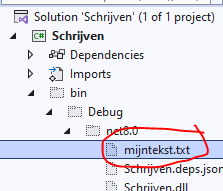
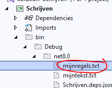
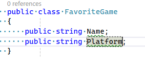
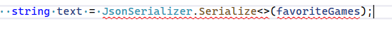
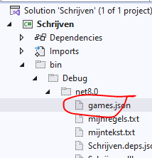
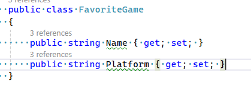
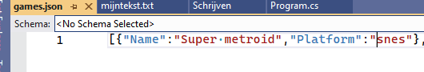
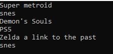

# 1 opstarten

## Project maken

- maak een nieuw Console project:
    - Schrijven
- zorg dat je weer een Run function hebt

## voorbereiden

- met de File class kun je ook tekst of regels schrijven
    - kijk naar de WriteAllText of WriteAllLines functions:
        - zie https://learn.microsoft.com/en-us/dotnet/api/system.io.file?view=net-8.0

- maak nu code die een tekst schrijft naar:
    - mijntekst.txt
## TEST

- RUN
    - kijk of de file verschenen is:
        >   
        
## regels

- maak nu code die een string[] (regels) schrijft naar:
    - mijnregels.txt
    - minimal 3 zinnen, bv een haiku
    

- RUN
    - kijk of de file verschenen is:
        >   
    - open ook de tekst file en check wat erin staat

## Json schrijven

- Maak nu een nieuwe class:
    >   
    - maak een array van FavoriteGames aan
        - minimaal 3
        - vul Name & Platform van allemaal
    - gebruik nu de code hieronder om van je favoriteGames [] een text te maken
        - Zet tussen de `<>` het volgende: `FavoriteGame[]`
            >   
    - schrijf de text naar games.json met File.WriteAllText

## TEST

- RUN
    - open je games.json
        >   
    
        - ... uhmm dat ziet er niet goed uit?

    - dat komt doordat we geen properties gebruiken
        - pas je class aan:
            >   
    - test nog een keer!
        - dit zou beter moeten gaan:
            >   

## inladen

- laad nu je games weer in zoals met producten
    - zet je games op het scherm
        >   

## commit

`commit` & `push` naar je git! 